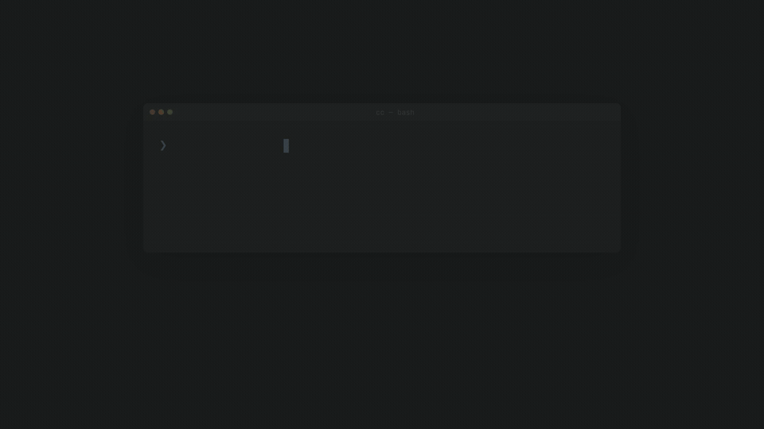
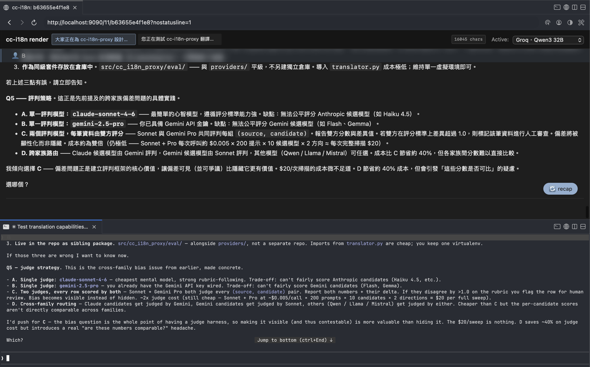

# cc-translate-proxy

讓 [Claude Code](https://claude.com/claude-code) 用英文跟 Anthropic 對話、你用繁中讀寫的 sidecar 翻譯 proxy。



## 為什麼做這個

兩件事讓我覺得值得寫個 sidecar：

1. **Claude Code 用英文比中文穩**。Anthropic 自家 [multilingual benchmark](https://platform.claude.com/docs/en/build-with-claude/multilingual-support) 顯示 Sonnet 4.5 中文（簡）對英文 MMLU 是 96.9%；最近一篇 [vibe coding 實測論文](https://arxiv.org/abs/2604.14210) 也指出中文 prompt 的問題解決率比英文低 4.5–9.9 個百分點。同樣語意中文 token 數還更多（[Petrov et al. 2023](https://arxiv.org/abs/2305.15425) 量過跨語 token 數可差 15x）。再加上 cc 會跟著「最後一句的語言」調整輸出，中英混打很容易把整段對話拉進中文模式。
2. **Sonnet 偶爾會自己切到韓文 / 日文**。這是已知 bug，繁中使用者在 [#30025](https://github.com/anthropics/claude-code/issues/30025)（中文中突切韓文）跟 [#46846](https://github.com/anthropics/claude-code/issues/46846)（CLAUDE.md 明寫繁中仍回日文）都有重現案例。光靠 prompt / CLAUDE.md 提醒治不住。

這個 proxy 介在 cc 跟 `api.anthropic.com` 中間：你打的繁中先翻成英文再送過去；模型回的英文一邊原樣回 cc，一邊翻成繁中渲染在本機網頁上。**CC 那邊的對話 100% 英文**（便宜、穩定、不會自己切日韓文），**你這邊讀到的 100% 繁中**。

## 截圖



上半部是 cc-translate-proxy 的本機繁中 render（瀏覽器 `localhost:9090/<uuid>`），下半部是 cc TUI 看到的英文版對話 — 同一輪對話、不同語言視角。網址 `?nostatusline=1` 是本機隱藏底部 statusline 用的截圖模式 query。

## 運作方式

```
你輸入「幫我重構這個函式」
   │
   ▼
cc-translate-proxy 攔截 /v1/messages
   ├─ 把繁中翻成英文（Gemini Flash / Groq / OpenRouter，自動切換）
   ├─ 英文版送 api.anthropic.com
   └─ 英文回應 fork 一份 → 翻成繁中 → 渲染到本機網頁

CC 看到乾淨英文對話；你瀏覽器讀到繁中 render。
```

## 使用前須知

- **你的 prompt 跟 cc 回覆會送給第三方 LLM**（預設 Gemini Flash）做翻譯。**含敏感內容的 session 不要開**。
- **本機會留兩份對話落檔**：audit log（翻譯前後的完整 prompt / 回覆，JSONL）在 `~/.cc-i18n-proxy/audit/`、render 用的 emit 檔（繁中 markdown）在 `~/.cc-i18n-proxy/emit/`。兩者都是除錯 / 渲染用，內容等同完整對話紀錄，要定期清。
- **個人實驗工具**，不適合 production。預期會碰到 bug。

## 快速開始

需要：Python 3.12+、[`uv`](https://github.com/astral-sh/uv)。

1. Clone 跟安裝：
   ```bash
   git clone https://github.com/gggodlin/cc-translate-proxy.git
   cd cc-translate-proxy
   uv sync
   ```

2. 設定翻譯 provider chain（複製範例後編輯）：
   ```bash
   mkdir -p ~/.cc-i18n-proxy
   cp providers.toml.example ~/.cc-i18n-proxy/providers.toml
   ```
   `providers.toml` 內 `default_chain` 控制嘗試順序、前面失敗才 fallback 到下一個。範例預設 `["gemini", "groq", "openrouter"]`，你可以刪到只剩一個或加入 `"ollama"`（本機免 key）。

3. 把對應的 API key 寫進 `~/.cc-i18n-proxy/.env`（變數名要跟 `providers.toml` 裡 `api_key_env` 對齊）：
   ```bash
   cat > ~/.cc-i18n-proxy/.env <<'EOF'
   GEMINI_API_KEY=your-key-here
   # GROQ_API_KEY=...
   # OPENROUTER_API_KEY=...
   EOF
   ```
   申請連結：[Gemini](https://aistudio.google.com/apikey) / [Groq](https://console.groq.com/keys) / [OpenRouter](https://openrouter.ai/keys)。任一個有就能跑，沒設的 provider 會自動從 chain 拿掉。

4. 把 cc 指向 proxy：
   ```bash
   export ANTHROPIC_BASE_URL=http://localhost:8080
   export ENABLE_TOOL_SEARCH=auto      # 把 deferred MCP 載入打開（見注意事項）
   ```

5. 啟動 proxy 跟 render server：
   ```bash
   uv run python -m cc_i18n_proxy > /tmp/proxy.log 2>&1 &
   uv run python scripts/render_server.py > /tmp/render.log 2>&1 &
   ```

6. 在任意 `claude` session 內打 `/intl` 啟動翻譯。

預設 proxy 是 **直通模式（passthrough）**，你打什麼它送什麼。`/intl` 把當前 session 加入翻譯白名單：產一個 session UUID、把 marker 塞進對話、之後可以在 `http://localhost:9090/<uuid>` 讀繁中 render。打 `/normal` 退出。

## 設定 `/intl` skill

`/intl` 是 cc 的 skill，不是這個 proxy 的一部分。在 `~/.claude/skills/intl/SKILL.md` 放最小範本：

````markdown
---
name: intl
description: 啟動 cc-translate-proxy 對當前 session 的翻譯模式。
---

產生 12-hex session UUID、把 marker emit 出去，proxy 會在下一個 outbound request 看到 marker 然後把這個 session 加入翻譯白名單。

```bash
UUID=$(python3 -c "import secrets; print(secrets.token_hex(6))")
echo "[CC_I18N_PROXY:ENABLE_THIS_SESSION:uuid=$UUID]"
echo "Render UI: http://localhost:9090/$UUID"
```

讓這個 skill 內容留在對話歷史裡，這樣 `/resume` 跟 proxy 重啟都能自動 recover marker。
````

對應的 `~/.claude/skills/normal/SKILL.md` 要 emit `[CC_I18N_PROXY:DISABLE_THIS_SESSION:uuid=<uuid>]` 退出翻譯。

marker 也可以附上 workspace 資訊（多專案並行時 render 首頁會按 workspace 分組）：

```
[CC_I18N_PROXY:ENABLE_THIS_SESSION:uuid=<uuid>:workspace=<id>:workspace_name=<名稱>]
```

不帶 workspace 時一律歸到 `default` 分組，功能不受影響。

## 注意事項

- **Auto-compaction 可能會把 marker 吃掉**：對話長到 ~50+ 輪時，cc 可能把早期訊息壓縮成 summary，順便把 `/intl` marker 也壓沒了。發生後再打一次 `/intl` 就好。
- **CC 在非 first-party host 會自動關掉 ToolSearch**。設 `ENABLE_TOOL_SEARCH=auto` 把 deferred MCP 載入打開。proxy 不動 `tool_reference` block 所以這樣安全。
- **翻譯不是免費**：Gemini Flash 很便宜但不是零成本。重度使用者要監控花費，failover 機制可以分散到多個 provider。

## 環境變數

| 變數 | 預設 | 用途 |
|---|---|---|
| `CC_I18N_PROXY_HOME` | `~/.cc-i18n-proxy` | 設定 / audit / emit / state 的根目錄 |
| `CC_I18N_PROXY_PORT` | `8080` | proxy 監聽 port |
| `CC_I18N_RENDER_PORT` | `9090` | render server 監聽 port |
| `CC_I18N_PROXY_EMIT_DIR` | `$CC_I18N_PROXY_HOME/emit` | 繁中 emit 檔輸出目錄 |

另附 `scripts/render.sh <session-id>`：不開瀏覽器、在 terminal 用 [glow](https://github.com/charmbracelet/glow) 直接 tail 繁中 emit 檔的輕量視圖。

## 測試

```bash
uv run pytest -v
```

## License

MIT — 見 [LICENSE](LICENSE)。
